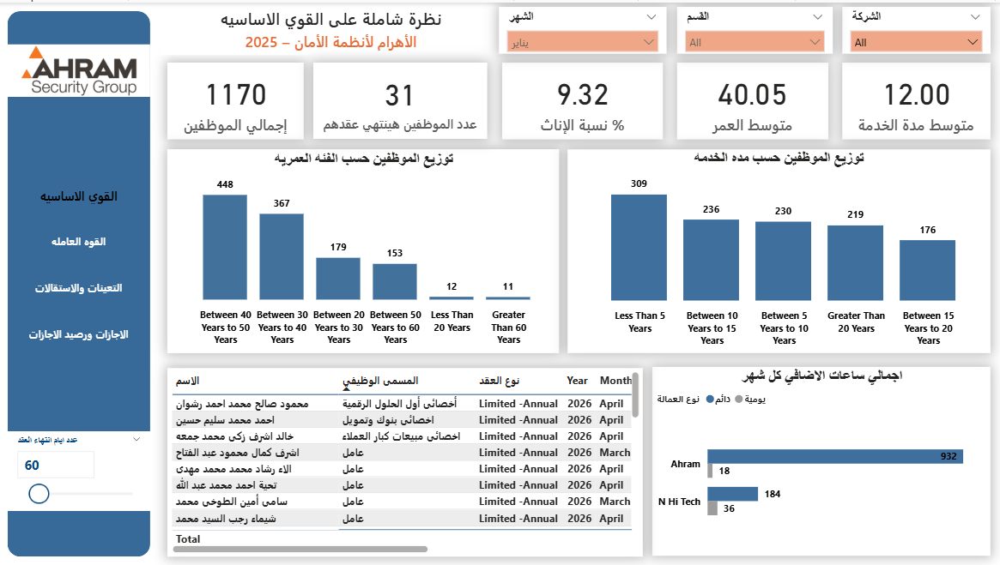

# HR-analysis-project
Comprehensive HR &amp; Workforce Analytics Dashboard built in Power BI for Ahram Security Group (2025).  Includes data cleaning, relational modeling (Star Schema), and interactive dashboards covering core workforce, dynamics, resignations &amp; appointments, and leave balances.
# Ahram Security Workforce Analytics Dashboard (2025)

##  Overview
Freelance project delivered for **Ahram Security Group** in 2025.  
The goal was to build a comprehensive **HR & Workforce Analytics Dashboard** in Power BI, starting from raw HR data and transforming it into actionable insights.  

---

##  Data Preparation
- Cleaned raw HR data (contracts, employees, leaves, resignations, overtime).  
- Standardized formats (dates, departments, contract types).  
- Added calculated fields: contract expiration days, turnover rate, net annual change.  

---

##  Data Modeling
Designed a relational **Star Schema** model:
- **Fact Tables**: resignations, appointments, leaves, overtime, workforce strength.  
- **Dimension Tables**: departments, months, entities, employee demographics.  
- Relationships built on department, month, and entity keys.  
- Parameters added (e.g., contract expiration days) for dynamic analysis.  

---

##  Dashboard Pages
1. **Core Workforce**  
   - Total employees, female percentage, avg age, avg service duration.  
   - Distribution by age group and service years.  

2. **Workforce Dynamics**  
   - Total workforce per month.  
   - Annual turnover rate.  
   - Net annual change.  
   - Overtime hours trend.  

3. **Resignations & Appointments**  
   - Monthly resignations vs appointments.  
   - Top departments with highest resignations/appointments.  
   - Pie chart by entity (Ahram vs Bremer).  

4. **Leaves & Balances**  
   - Sick leave percentage, avg leave balance per employee.  
   - Top departments by leave balance and sick leave.  
   - Types of leave (work injury, maternity, deducted, special).  

---

##  Key Insights
- Workforce stability challenges: annual net change = -45.  
- High turnover concentrated in production department.  
- Overtime peaked in Q3 (Aug–Sep).  
- Sick leave accounted for ~9% of total leave.  
- Contract expiration parameter helped HR anticipate renewals.  

---

##  Recommendations
- Focus retention strategies on production department.  
- Monitor overtime spikes as potential workload imbalance.  
- Improve leave management policies to reduce sick leave ratio.  
- Use contract expiration parameter for proactive HR planning.  

---

##  Tools Used
- **Power Query** (data cleaning).  
- **Power BI** (dashboard design).  
- **Data Modeling** (Star Schema).

## Project Structure

│
├── images/              # Dashboard screenshots
│   ├── core_workforce.png
│   ├── workforce_dynamics.png
│   ├── resignations_appointments.png
│   └── leaves_balances.png
│
├── model/               # Data model diagram
│   └── hr_data_model.png
│
└── README.md            # Documentation

---

## Conclusion
This project demonstrated how **data cleaning + modeling + visualization** can transform raw HR data into strategic insights for workforce planning and management.

